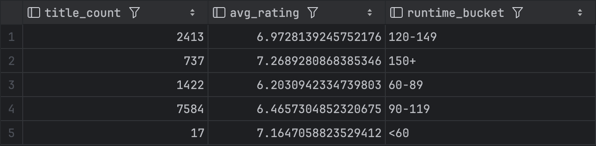
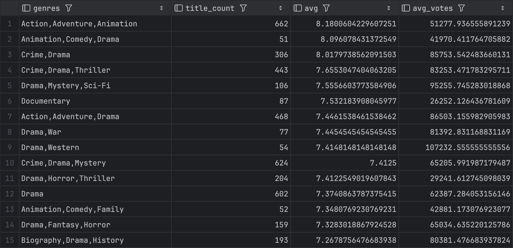
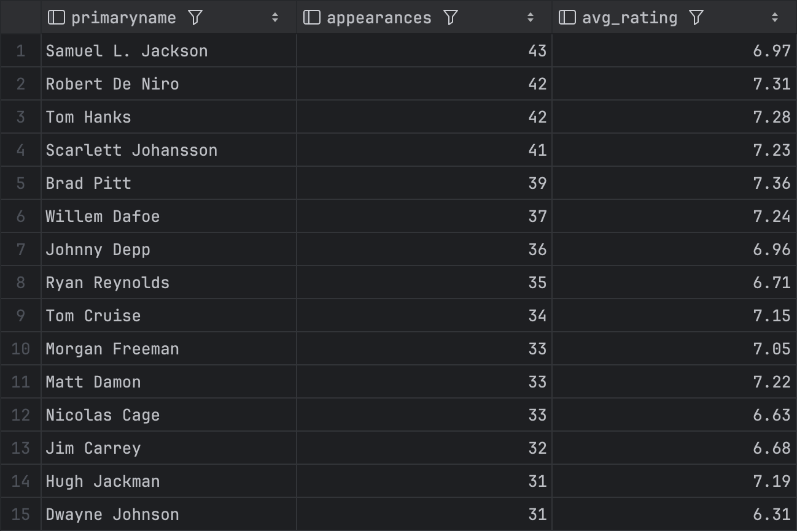

# IMDb Data Analysis

This project analyzes IMDb data using SQL and PostgreSQL to explore ratings, genres, title types, runtime, and actor appearances.

## Tools
- SQL
- PostgreSQL
- DataGrip

## Files
- `schema.sql` - creates the database tables
- `queries.sql` - contains analysis queries

## Questions Explored
- Which titles have the highest ratings with strong vote counts?
- Which genres have the highest average ratings?
- How do ratings vary by title type and year?
- How does runtime relate to ratings?
- Which actors appear most often in highly rated titles?

## Runtime vs Rating

Longer movies tend to have slightly higher average ratings compared to shorter films.

## Genre Analysis

Certain genres consistently receive higher average ratings, especially those with strong audience engagement and higher vote counts.

## Actor Performance Analysis

Actors who appear in multiple high-vote movies tend to consistently be part of well-received films. This highlights performers who frequently contribute to successful, widely watched projects.
